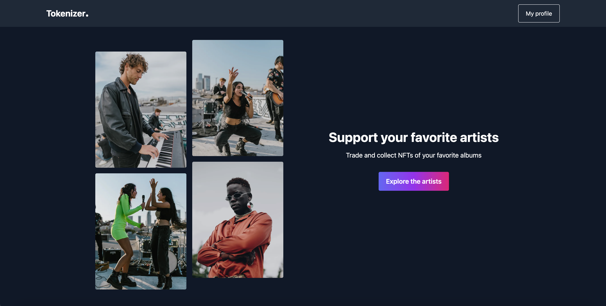

# Tokenizer ✨

Work in progess : This project is still a draft and is not finished yet 🧑‍💻

[https://tokenizer-front.vercel.app/](https://tokenizer-front.vercel.app/)

Side project built to learn Solidity where Musicians can create NFTs for their albums and sell them to their fans.

## Fans 😍

It's a way fot the fans to support directly their favorite artists and be part of their community.

## Artists 🦹‍♀️

It's a way for artists to generate more revenues from their music, engage their audience and be able to create special events and offers for their NFTs owners.

@dev.
// TODO: Create the album page from the front-end
// Add the albums' metadata to the NFTs from the front-end.
contracts/Tokenizer.sol.l42
